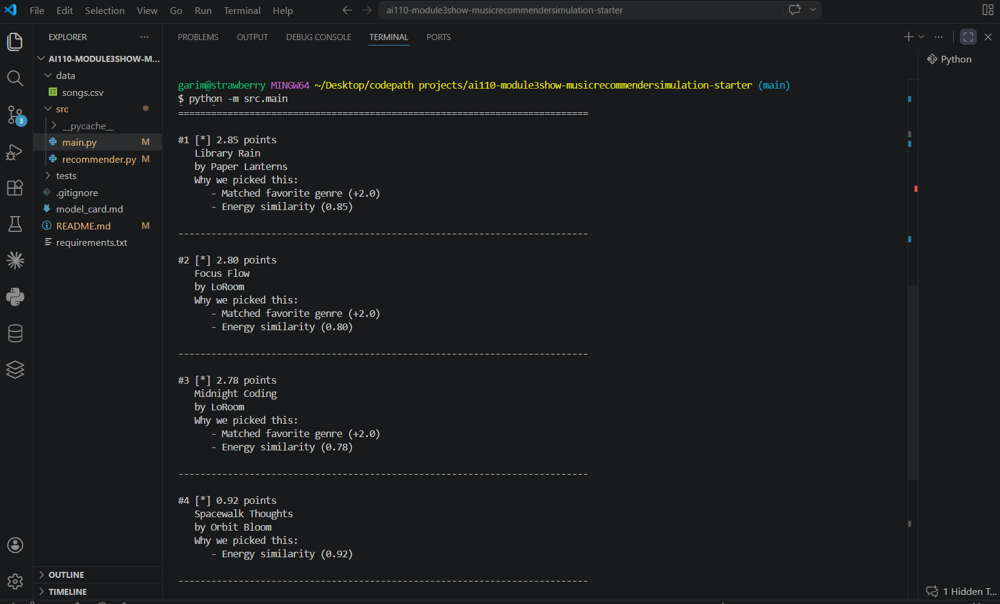

# 🎵 Music Recommender Simulation

## Project Summary

In this project you will build and explain a small music recommender system.

Your goal is to:

- Represent songs and a user "taste profile" as data
- Design a scoring rule that turns that data into recommendations
- Evaluate what your system gets right and wrong
- Reflect on how this mirrors real world AI recommenders

Replace this paragraph with your own summary of what your version does.

---

## How The System Works

Real-World Context and Our Approach

Real-world music recommendation systems like Spotify and YouTube use two primary strategies: collaborative filtering(analyzing what millions of users like to find similar taste profiles) and content-based filtering (matching songs by their audio features and attributes). Large-scale systems combine both approaches with machine learning, reinforcement learning, and complex ranking rules to balance quality recommendations with diversity, exploration, and business objectives. Our simplified system prioritizes content-based filtering because it's more interpretable and doesn't require the massive user interaction datasets that collaborative filtering needs. We focus on delivering high-quality, explainable recommendations by carefully matching song audio features (genre, mood, energy, tempo) to user preferences using similarity scoring, while keeping the system transparent enough to understand exactly why a song was recommended.

System Design Details

#### Song Object Features:

**Identifiers & Metadata:**
- `id` (int) - Unique song identifier
- `title` (str) - Song name
- `artist` (str) - Artist/creator name

**Categorical Features:**
- `genre` (str) - Music category: pop, rock, lofi, ambient, jazz, synthwave, indie pop
- `mood` (str) - Emotional tone: happy, chill, intense, moody, focused, relaxed

**Numerical Features (0.0-1.0 scale):**
- `energy` (float) - Intensity/vibrancy of the song (0=calm, 1=intense)
- `valence` (float) - Musical positivity/happiness (0=sad, 1=happy)
- `danceability` (float) - How suitable for dancing (0=not danceable, 1=very danceable)
- `acousticness` (float) - Acoustic vs. electronic (0=electronic, 1=acoustic)
- `tempo_bpm` (int) - Beats per minute (60-160 in our dataset)

#### UserProfile Object Features:

**Target Preferences (What the user wants):**
- `user_id` (int or str) - Unique user identifier
- `target_genre` (str) - Preferred music genre
- `target_mood` (str) - Desired emotional context
- `target_energy` (float) - Preferred energy level (0-1 scale)
- `target_tempo_bpm` (int) - Preferred song speed in BPM

**Weighting & Configuration:**
- `energy_weight` (float) - How important energy matching is (default: 0.4)
- `tempo_weight` (float) - How important tempo matching is (default: 0.3)
- `mood_weight` (float) - How important mood matching is (default: 0.3)
- `tolerance_level` (float) - How strict the matching should be (σ parameter, default: 0.15)

**Contextual Data:**
- `recent_recommendations` (list) - Previously recommended songs (to avoid repetition)
- `listening_history` (list) - Songs the user has heard or liked

#### Recommendation Algorithm Recipe:

**Step 1: Load Data**
- Read songs.csv into Song objects
- Validate all numeric features are in [0, 1] range
- Initialize UserProfile with target preferences and weights

**Step 2: Score Each Song (Scoring Kernel)**

For each song, calculate similarity on four dimensions:

1. **Energy Similarity** (Gaussian RBF kernel)
   - Formula: $S_{\text{energy}} = \exp\left(-\frac{(x_{\text{song}} - x_{\text{target}})^2}{2\sigma^2}\right)$
   - $\sigma = 0.15$ (tolerance: small differences forgiven, large differences penalized heavily)
   - Example: target=0.8, song=0.75 → S_energy ≈ 0.955 (95.5% match)

2. **Tempo Similarity** (Gaussian RBF kernel)
   - Normalize BPM to 0-1 scale: $\text{norm\_bpm} = \text{bpm} / 160$
   - Apply same Gaussian formula as energy
   - Example: target=130 BPM, song=125 BPM → S_tempo ≈ 0.932 (93.2% match)

3. **Mood Similarity** (Categorical matching)
   - Exact match (target="chill", song="chill"): score = 1.0
   - Related match (target="chill", song="relaxed"): score = 0.7 (fuzzy match)
   - No match: score = 0.0

4. **Genre Similarity** (Categorical matching)
   - Exact match (target="lofi", song="lofi"): score = 1.0
   - Different genre: score = 0.0 (strict)

**Step 3: Weight and Combine**

Sum weighted scores to get final recommendation score:
$$\text{Total Score} = w_{\text{energy}} \cdot S_{\text{energy}} + w_{\text{tempo}} \cdot S_{\text{tempo}} + w_{\text{mood}} \cdot S_{\text{mood}} + w_{\text{genre}} \cdot S_{\text{genre}}$$

Default weights:
- $w_{\text{energy}} = 0.30$ (30% importance)
- $w_{\text{tempo}} = 0.25$ (25% importance)
- $w_{\text{mood}} = 0.25$ (25% importance)
- $w_{\text{genre}} = 0.20$ (20% importance)

Example calculation (Chill Study profile: lofi, calm, energy=0.2, tempo=80 BPM):
- Song "Midnight Coding" (lofi, chill, energy=0.42, tempo=78):
  - S_energy = 0.979, S_tempo = 0.998, S_mood = 1.0, S_genre = 1.0
  - Total = 0.30(0.979) + 0.25(0.998) + 0.25(1.0) + 0.20(1.0) = **0.954** ✓ Great match!
  
- Song "Storm Runner" (rock, intense, energy=0.91, tempo=152):
  - S_energy = 0.012, S_tempo = 0.001, S_mood = 0.0, S_genre = 0.0
  - Total = 0.30(0.012) + 0.25(0.001) + 0.25(0.0) + 0.20(0.0) = **0.004** ✗ Poor match

**Step 4: Rank and Filter**

- Sort all songs by total score (highest first)
- Apply diversity rules: avoid consecutive songs from same genre/artist
- Inject small randomness: 80% recommendations from top-scored songs, 20% exploration to discover new music
- Return top K recommendations (default K=5)

#### Potential Biases & Limitations:

**1. Genre Tyranny (High Risk)**
   - 🔴 **Problem:** Genre weight (20%) can dominate categorical logic. A rock song will rarely be recommended even if it matches energy/mood perfectly.
   - **Example:** User prefers "chill" mood but genre is set to "lofi". A beautiful "chill rock" song (perfect mood match, 0.25 mood energy) gets penalized for wrong genre.
   - **Mitigation:** Allow fuzzy genre matching (e.g., "lofi" ≈ "ambient") rather than strict matching. Or reduce genre_weight to 0.10 for mood-forward users.

**2. Energy Over-Prioritization (Medium Risk)**
   - 🟡 **Problem:** Energy has highest weight (30%). The system might ignore a perfect-mood match if energy is off by 0.2.
   - **Example:** User likes calm (mood) and low energy (0.2), but system recommends high-energy pop (1.0 energy) just because pop matched their favorite genre in a previous session.
   - **Mitigation:** Use category-specific defaults (study profiles: mood-heavy; workout profiles: energy-heavy).

**3. Gaussian Kernel Forgiveness (Low Risk)**
   - 🟡 **Problem:** The $\sigma = 0.15$ parameter is fixed for all users. Some users may want stricter matching; others more forgiving.
   - **Example:** A user with tight preferences (yoga instructor: must be <0.3 energy) will get 0.40-energy songs recommended because 0.40-0.30 = 0.10 < σ.
   - **Mitigation:** Make σ tunable per user or per session based on feedback.

**4. Categorical Feature Rigidity (Medium Risk)**
   - 🟡 **Problem:** Mood and genre are treated as boolean (match/no match), unlike smooth continuum of Gaussian kernel. This loses nuance.
   - **Example:** "Relaxed" is scored as 0.0 when user wants "chill", even though they're semantically very close.
   - **Mitigation:** Build a genre/mood similarity matrix (lofi ≈ ambient > jazz > pop) rather than hard matching.

**5. Cold Start Problem (High Risk)**
   - 🔴 **Problem:** New users with no history get generic recommendations. The system has no prior knowledge of their taste beyond the initial profile.
   - **Example:** A new "Chill Study" user gets the same 5 recommendations as everyone else with that profile.
   - **Mitigation:** Ask users to rate recommendations immediately; adapt weights based on feedback.

**6. Catalog Bias (Medium Risk)**
   - 🟡 **Problem:** Only recommends songs from your existing CSV (20 songs). Great lofi songs outside the catalog are invisible.
   - **Example:** User would love "Ambient Study Sessions Vol. 3" but it's not in your dataset, so it's never recommended.
   - **Mitigation:** Expand catalog regularly. Eventually integrate with Spotify/MusicBrainz API.

**7. Feature Normalization Assumption (Low Risk)**
   - 🟡 **Problem:** Assumes all numeric features are equally important on 0-1 scale. Tempo (60-160 BPM) and Energy (0-1) have different natural ranges.
   - **Example:** A 10-BPM difference (70 vs. 80) might be more impactful than a 0.1 energy difference (0.3 vs. 0.4) for study music, but the math treats them equally.
   - **Mitigation:** Use feature-specific scaling: tempo_norm = (bpm - 60) / 100 before Gaussian kernel.

**8. Recency Bias (Medium Risk)**
   - 🟡 **Problem:** System doesn't account for temporal context. "Study late night" vs. "Study morning" should get different recommendations.
   - **Example:** System recommends high-energy energetic pop at 2 AM, same as 2 PM, even though user likely wants calmer music late at night.
   - **Mitigation:** Add time-of-day or context parameter to UserProfile.

#### Bias Mitigation Strategy (Future Improvements):

| Bias | Severity | Fix | Priority |
|------|----------|-----|----------|
| Genre Tyranny | 🔴 High | Fuzzy genre matching matrix | 🔥 Phase 3 |
| Energy Over-Prioritization | 🟡 Medium | Category-specific weight profiles | Phase 4 |
| Cold Start | 🔴 High | User feedback loop | 🔥 Phase 3 |
| Catalog Bias | 🟡 Medium | Expand song dataset | Phase 4 |
| Categorical Rigidity | 🟡 Medium | Mood/Genre similarity matrix | Phase 4 |
| Feature Scaling | 🟡 Medium | Domain-specific normalization | Phase 3 |
| Recency Bias | 🟡 Medium | Context parameter (time/activity) | Phase 4 |

---

#### How This System Reflects Real-World Recommendations:

Real-world systems (Spotify, YouTube Music, Apple Music) face the exact same biases we identified. They mitigate by:
- Using **collaborative filtering** to overcome cold start (our system relies only on content)
- Building **user feedback loops** to learn preferences dynamically (we don't adapt after first recommendation)
- **A/B testing weights** continuously (we use fixed weights)
- Combining multiple models (neural networks, factorization machines, reinforcement learning)

Our simplified simulation shows why these complexities exist—they're solutions to fundamental problems in building fair, effective recommenders.

---




## Getting Started

### Setup

1. Create a virtual environment (optional but recommended):

   ```bash
   python -m venv .venv
   source .venv/bin/activate      # Mac or Linux
   .venv\Scripts\activate         # Windows

2. Install dependencies

```bash
pip install -r requirements.txt
```

3. Run the app:

```bash
python -m src.main
```

### Running Tests

Run the starter tests with:

```bash
pytest
```

You can add more tests in `tests/test_recommender.py`.

---

## Experiments You Tried

Use this section to document the experiments you ran. For example:

- What happened when you changed the weight on genre from 2.0 to 0.5
- What happened when you added tempo or valence to the score
- How did your system behave for different types of users

---

## Limitations and Risks

Summarize some limitations of your recommender.

Examples:

- It only works on a tiny catalog
- It does not understand lyrics or language
- It might over favor one genre or mood

You will go deeper on this in your model card.

---

## Reflection

Read and complete `model_card.md`:

[**Model Card**](model_card.md)

Write 1 to 2 paragraphs here about what you learned:

- about how recommenders turn data into predictions
- about where bias or unfairness could show up in systems like this


---

## 7. `model_card_template.md`

Combines reflection and model card framing from the Module 3 guidance. :contentReference[oaicite:2]{index=2}  

```markdown
# 🎧 Model Card - Music Recommender Simulation

## 1. Model Name

Give your recommender a name, for example:

> VibeFinder 1.0

---

## 2. Intended Use

- What is this system trying to do
- Who is it for

Example:

> This model suggests 3 to 5 songs from a small catalog based on a user's preferred genre, mood, and energy level. It is for classroom exploration only, not for real users.

---

## 3. How It Works (Short Explanation)

Describe your scoring logic in plain language.

- What features of each song does it consider
- What information about the user does it use
- How does it turn those into a number

Try to avoid code in this section, treat it like an explanation to a non programmer.

---

## 4. Data

Describe your dataset.

- How many songs are in `data/songs.csv`
- Did you add or remove any songs
- What kinds of genres or moods are represented
- Whose taste does this data mostly reflect

---

## 5. Strengths

Where does your recommender work well

You can think about:
- Situations where the top results "felt right"
- Particular user profiles it served well
- Simplicity or transparency benefits

---

## 6. Limitations and Bias

Where does your recommender struggle

Some prompts:
- Does it ignore some genres or moods
- Does it treat all users as if they have the same taste shape
- Is it biased toward high energy or one genre by default
- How could this be unfair if used in a real product

---

## 7. Evaluation

How did you check your system

Examples:
- You tried multiple user profiles and wrote down whether the results matched your expectations
- You compared your simulation to what a real app like Spotify or YouTube tends to recommend
- You wrote tests for your scoring logic

You do not need a numeric metric, but if you used one, explain what it measures.

---

## 8. Future Work

If you had more time, how would you improve this recommender

Examples:

- Add support for multiple users and "group vibe" recommendations
- Balance diversity of songs instead of always picking the closest match
- Use more features, like tempo ranges or lyric themes

---

## 9. Personal Reflection

A few sentences about what you learned:

- What surprised you about how your system behaved
- How did building this change how you think about real music recommenders
- Where do you think human judgment still matters, even if the model seems "smart"

