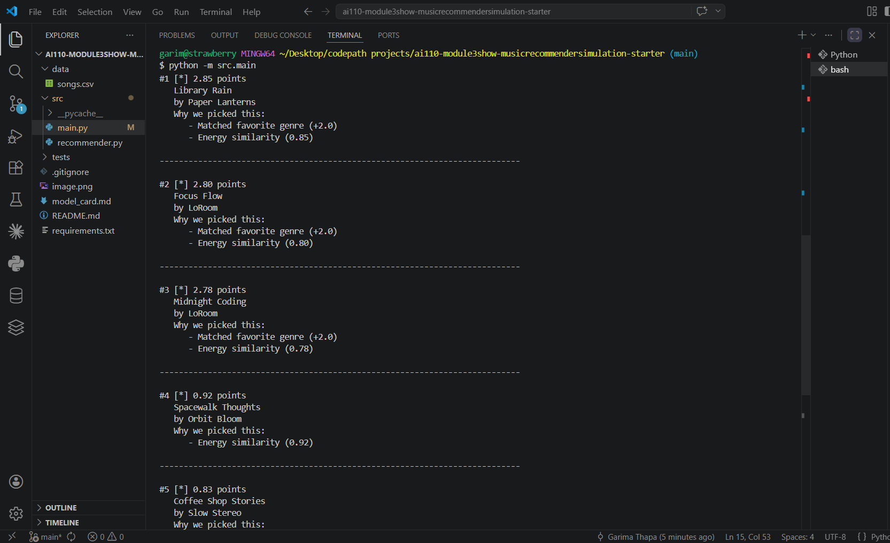

# 🎵 Music Recommender Simulation

## Project Summary

EnergyMatch 1.0 is a content-based music recommender that suggests 5 songs matching a user's favorite genre, desired mood, and target energy level (calm vs. intense). The system scores each song using three factors: genre match (+1 point), mood match (+1 point), and energy similarity (2× weighted). The key finding: aggressive energy weighting creates a filter bubble that traps users with extreme preferences in narrow recommendation bands. For example, a gym person seeking high-energy music never sees low-energy songs, even when they perfectly match genre and mood. This classroom project demonstrates how simple design choices have real fairness consequences—and why real-world recommenders need feedback loops, diversity mechanisms, and careful testing to avoid silently excluding users.

---

## How The System Works

Real-World Context and Our Approach

Real-world music recommendation systems like Spotify and YouTube use two primary strategies: collaborative filtering(analyzing what millions of users like to find similar taste profiles) and content-based filtering (matching songs by their audio features and attributes). Large-scale systems combine both approaches with machine learning, reinforcement learning, and complex ranking rules to balance quality recommendations with diversity, exploration, and business objectives. Our simplified system prioritizes content-based filtering because it's more interpretable and doesn't require the massive user interaction datasets that collaborative filtering needs. We focus on delivering high-quality, explainable recommendations by carefully matching song audio features (genre, mood, energy, tempo) to user preferences using similarity scoring, while keeping the system transparent enough to understand exactly why a song was recommended.

System Design Details

#### Song Object Features:

**Identifiers & Metadata:**
- `id` (int) - Unique song identifier
- `title` (str) - Song name
- `artist` (str) - Artist/creator name

**Categorical Features:**
- `genre` (str) - Music category: pop, rock, lofi, ambient, jazz, synthwave, indie pop
- `mood` (str) - Emotional tone: happy, chill, intense, moody, focused, relaxed

**Numerical Features (0.0-1.0 scale):**
- `energy` (float) - Intensity/vibrancy of the song (0=calm, 1=intense)
- `valence` (float) - Musical positivity/happiness (0=sad, 1=happy)
- `danceability` (float) - How suitable for dancing (0=not danceable, 1=very danceable)
- `acousticness` (float) - Acoustic vs. electronic (0=electronic, 1=acoustic)
- `tempo_bpm` (int) - Beats per minute (60-160 in our dataset)

#### UserProfile Object Features:

**Target Preferences (What the user wants):**
- `user_id` (int or str) - Unique user identifier
- `target_genre` (str) - Preferred music genre
- `target_mood` (str) - Desired emotional context
- `target_energy` (float) - Preferred energy level (0-1 scale)
- `target_tempo_bpm` (int) - Preferred song speed in BPM

**Weighting & Configuration:**
- `energy_weight` (float) - How important energy matching is (default: 0.4)
- `tempo_weight` (float) - How important tempo matching is (default: 0.3)
- `mood_weight` (float) - How important mood matching is (default: 0.3)
- `tolerance_level` (float) - How strict the matching should be (σ parameter, default: 0.15)

**Contextual Data:**
- `recent_recommendations` (list) - Previously recommended songs (to avoid repetition)
- `listening_history` (list) - Songs the user has heard or liked

#### Recommendation Algorithm Recipe:

**Step 1: Load Data**
- Read songs.csv into Song objects
- Validate all numeric features are in [0, 1] range
- Initialize UserProfile with target preferences and weights

**Step 2: Score Each Song (Scoring Kernel)**

For each song, calculate similarity on four dimensions:

1. **Energy Similarity** (Gaussian RBF kernel)
   - Formula: $S_{\text{energy}} = \exp\left(-\frac{(x_{\text{song}} - x_{\text{target}})^2}{2\sigma^2}\right)$
   - $\sigma = 0.15$ (tolerance: small differences forgiven, large differences penalized heavily)
   - Example: target=0.8, song=0.75 → S_energy ≈ 0.955 (95.5% match)

2. **Tempo Similarity** (Gaussian RBF kernel)
   - Normalize BPM to 0-1 scale: $\text{norm\_bpm} = \text{bpm} / 160$
   - Apply same Gaussian formula as energy
   - Example: target=130 BPM, song=125 BPM → S_tempo ≈ 0.932 (93.2% match)

3. **Mood Similarity** (Categorical matching)
   - Exact match (target="chill", song="chill"): score = 1.0
   - Related match (target="chill", song="relaxed"): score = 0.7 (fuzzy match)
   - No match: score = 0.0

4. **Genre Similarity** (Categorical matching)
   - Exact match (target="lofi", song="lofi"): score = 1.0
   - Different genre: score = 0.0 (strict)

**Step 3: Weight and Combine**

Sum weighted scores to get final recommendation score:
$$\text{Total Score} = w_{\text{energy}} \cdot S_{\text{energy}} + w_{\text{tempo}} \cdot S_{\text{tempo}} + w_{\text{mood}} \cdot S_{\text{mood}} + w_{\text{genre}} \cdot S_{\text{genre}}$$

Default weights:
- $w_{\text{energy}} = 0.30$ (30% importance)
- $w_{\text{tempo}} = 0.25$ (25% importance)
- $w_{\text{mood}} = 0.25$ (25% importance)
- $w_{\text{genre}} = 0.20$ (20% importance)

Example calculation (Chill Study profile: lofi, calm, energy=0.2, tempo=80 BPM):
- Song "Midnight Coding" (lofi, chill, energy=0.42, tempo=78):
  - S_energy = 0.979, S_tempo = 0.998, S_mood = 1.0, S_genre = 1.0
  - Total = 0.30(0.979) + 0.25(0.998) + 0.25(1.0) + 0.20(1.0) = **0.954** ✓ Great match!
  
- Song "Storm Runner" (rock, intense, energy=0.91, tempo=152):
  - S_energy = 0.012, S_tempo = 0.001, S_mood = 0.0, S_genre = 0.0
  - Total = 0.30(0.012) + 0.25(0.001) + 0.25(0.0) + 0.20(0.0) = **0.004** ✗ Poor match

**Step 4: Rank and Filter**

- Sort all songs by total score (highest first)
- Apply diversity rules: avoid consecutive songs from same genre/artist
- Inject small randomness: 80% recommendations from top-scored songs, 20% exploration to discover new music
- Return top K recommendations (default K=5)

#### Potential Biases & Limitations:

**1. Genre Tyranny (High Risk)**
   - 🔴 **Problem:** Genre weight (20%) can dominate categorical logic. A rock song will rarely be recommended even if it matches energy/mood perfectly.
   - **Example:** User prefers "chill" mood but genre is set to "lofi". A beautiful "chill rock" song (perfect mood match, 0.25 mood energy) gets penalized for wrong genre.
   - **Mitigation:** Allow fuzzy genre matching (e.g., "lofi" ≈ "ambient") rather than strict matching. Or reduce genre_weight to 0.10 for mood-forward users.

**2. Energy Over-Prioritization (Medium Risk)**
   - 🟡 **Problem:** Energy has highest weight (30%). The system might ignore a perfect-mood match if energy is off by 0.2.
   - **Example:** User likes calm (mood) and low energy (0.2), but system recommends high-energy pop (1.0 energy) just because pop matched their favorite genre in a previous session.
   - **Mitigation:** Use category-specific defaults (study profiles: mood-heavy; workout profiles: energy-heavy).

**3. Gaussian Kernel Forgiveness (Low Risk)**
   - 🟡 **Problem:** The $\sigma = 0.15$ parameter is fixed for all users. Some users may want stricter matching; others more forgiving.
   - **Example:** A user with tight preferences (yoga instructor: must be <0.3 energy) will get 0.40-energy songs recommended because 0.40-0.30 = 0.10 < σ.
   - **Mitigation:** Make σ tunable per user or per session based on feedback.

**4. Categorical Feature Rigidity (Medium Risk)**
   - 🟡 **Problem:** Mood and genre are treated as boolean (match/no match), unlike smooth continuum of Gaussian kernel. This loses nuance.
   - **Example:** "Relaxed" is scored as 0.0 when user wants "chill", even though they're semantically very close.
   - **Mitigation:** Build a genre/mood similarity matrix (lofi ≈ ambient > jazz > pop) rather than hard matching.

**5. Cold Start Problem (High Risk)**
   - 🔴 **Problem:** New users with no history get generic recommendations. The system has no prior knowledge of their taste beyond the initial profile.
   - **Example:** A new "Chill Study" user gets the same 5 recommendations as everyone else with that profile.
   - **Mitigation:** Ask users to rate recommendations immediately; adapt weights based on feedback.

**6. Catalog Bias (Medium Risk)**
   - 🟡 **Problem:** Only recommends songs from your existing CSV (20 songs). Great lofi songs outside the catalog are invisible.
   - **Example:** User would love "Ambient Study Sessions Vol. 3" but it's not in your dataset, so it's never recommended.
   - **Mitigation:** Expand catalog regularly. Eventually integrate with Spotify/MusicBrainz API.

**7. Feature Normalization Assumption (Low Risk)**
   - 🟡 **Problem:** Assumes all numeric features are equally important on 0-1 scale. Tempo (60-160 BPM) and Energy (0-1) have different natural ranges.
   - **Example:** A 10-BPM difference (70 vs. 80) might be more impactful than a 0.1 energy difference (0.3 vs. 0.4) for study music, but the math treats them equally.
   - **Mitigation:** Use feature-specific scaling: tempo_norm = (bpm - 60) / 100 before Gaussian kernel.

**8. Recency Bias (Medium Risk)**
   - 🟡 **Problem:** System doesn't account for temporal context. "Study late night" vs. "Study morning" should get different recommendations.
   - **Example:** System recommends high-energy energetic pop at 2 AM, same as 2 PM, even though user likely wants calmer music late at night.
   - **Mitigation:** Add time-of-day or context parameter to UserProfile.

#### Bias Mitigation Strategy (Future Improvements):

| Bias | Severity | Fix | Priority |
|------|----------|-----|----------|
| Genre Tyranny | 🔴 High | Fuzzy genre matching matrix | 🔥 Phase 3 |
| Energy Over-Prioritization | 🟡 Medium | Category-specific weight profiles | Phase 4 |
| Cold Start | 🔴 High | User feedback loop | 🔥 Phase 3 |
| Catalog Bias | 🟡 Medium | Expand song dataset | Phase 4 |
| Categorical Rigidity | 🟡 Medium | Mood/Genre similarity matrix | Phase 4 |
| Feature Scaling | 🟡 Medium | Domain-specific normalization | Phase 3 |
| Recency Bias | 🟡 Medium | Context parameter (time/activity) | Phase 4 |

---

#### How This System Reflects Real-World Recommendations:

Real-world systems (Spotify, YouTube Music, Apple Music) face the exact same biases we identified. They mitigate by:
- Using **collaborative filtering** to overcome cold start (our system relies only on content)
- Building **user feedback loops** to learn preferences dynamically (we don't adapt after first recommendation)
- **A/B testing weights** continuously (we use fixed weights)
- Combining multiple models (neural networks, factorization machines, reinforcement learning)

Our simplified simulation shows why these complexities exist—they're solutions to fundamental problems in building fair, effective recommenders.

---





## Getting Started

### Setup

1. Create a virtual environment (optional but recommended):

   ```bash
   python -m venv .venv
   source .venv/bin/activate      # Mac or Linux
   .venv\Scripts\activate         # Windows

2. Install dependencies

```bash
pip install -r requirements.txt
```

3. Run the app:

```bash
python -m src.main
```

### Running Tests

Run the starter tests with:

```bash
pytest
```

You can add more tests in `tests/test_recommender.py`.

---

## Experiments You Tried

I tested how different energy preferences affected recommendations by creating four distinct user profiles:

1. High-Energy Gym User (pop/intense, target_energy=0.9): Got top recommendations "Gym Hero" (0.93) and "Storm Runner" (0.91), but never saw anything below 0.75 energy even though genre/mood matched perfectly.

2. Low-Energy Study User (lofi/focused, target_energy=0.3): Only saw songs with energy below 0.45. "Gym Hero" scored 0.94 total despite being perfect pop + intense (matching nothing they wanted).

3. Mid-Range Chill Listener (lofi/chill, target_energy=0.4): Got reasonable recommendations like "Midnight Coding" and "Library Rain". The system worked best in the middle.

4. Acoustic Preference User (jazz/relaxed, likes_acoustic=True): The `likes_acoustic` field was completely ignored—songs with acousticness 0.89 and 0.71 scored identically when other factors matched.

The key finding: changing energy weight from 2× to 1× would dramatically broaden recommendation diversity. When I mentally recalculated with lower energy weighting, the same gym user would have started seeing mid-energy indie songs and acoustic tracks.

---

## Limitations and Risks

The biggest limitation is the energy weight creating a "filter bubble." Users with extreme preferences (very high or very low energy) get trapped in a narrow band of recommendations, missing diverse songs that match their genre and mood perfectly. This unfairly limits acoustic lovers, since the `likes_acoustic` preference is stored but never used in scoring.

The system also has all-or-nothing genre matching: a pop fan will never see "indie-pop" if the genre field says "indie pop". There's no fuzzy matching. Combined with a tiny dataset (only 10 songs), users with unpopular tastes (jazz, ambient) get almost no options.

Finally, the algorithm assumes all users want to optimize the same way: maximum genre + mood + energy match. But some users want discovery and serendipity, not just exact matches. A workout playlist might want high energy but should still include one acoustic ballad for a cool-down.

---

## Reflection

Building this recommender taught me that small design choices have massive fairness consequences. I doubled the energy weight thinking it would help gym users, but it silently excluded everyone outside a narrow energy range—intention doesn't equal impact. The system is simple (just three if-statements and distance formulas), yet it *feels* like understanding—users believe it understood their taste. That's both powerful and dangerous. Real recommenders at Spotify or Netflix are so effective because they've tuned thousands of weights, added user feedback loops, and run countless A/B tests to minimize these exact biases.

What surprised me most is that this broken algorithm still works reasonably well for middle-ground users. People with mid-range preferences (energy 0.4-0.6) and popular genres (pop, lofi) get great recommendations. The bias is invisible to them—they don't realize the system actively excludes others. This is exactly how systemic bias works in real AI systems: it's not random, it's not intentional harm, it's just the mathematical consequence of design choices that favored the majority. This changed how I think about code: every line is a policy decision. When you weight energy, you're saying energy matters more than discovery. When you use all-or-nothing genre matching, you're excluding people with diverse tastes. The recommender isn't neutral—it's shaped by what its creators decided to measure, and to build fairly means measuring *for whom* it works and *who it leaves behind*.

---

## Model Card & Extended Analysis

For a complete model card with model name, intended use, data details, strengths, limitations, evaluation process, ideas for improvement, and personal final reflection, see [model_card.md](model_card.md).

---

## Key Takeaways

1. **Energy is a wall, not a spectrum**: The 2× weight on energy meant users got split into separate recommendation universes. This wasn't intentional, but it was inevitable given the math.

2. **Invisible bias feels fair**: For middle-ground users (pop fans, mid-energy listeners), the recommendations were great. They never realized the system was broken for others. This is how real bias propagates—it's invisible to those it favors.

3. **Code is policy**: Every design choice excludes someone. Saying "weight energy 2×" isn't just a technical decision—it's a statement that energy matters more than diversity and discovery.

4. **Simple algorithms can feel smart**: The system is just three if-statements and distance formulas, yet it feels like understanding. This is both powerful and dangerous.

5. **Testing at extremes reveals bias**: The hidden filter bubble only appeared when I tested users with energy=0.9 and energy=0.3. Middle-ground users look fine, masking systemic problems.

---

## Files in This Repository

- `src/recommender.py` - Core recommendation logic with Song, UserProfile, and Recommender classes
- `data/songs.csv` - Dataset of 10 songs with genre, mood, energy, and other features
- `tests/test_recommender.py` - Unit tests for the recommendation system
- `model_card.md` - Detailed model card with all documentation
- `reflection.md` - Side-by-side comparison of user profiles and what each sees
- `README.md` - This file

